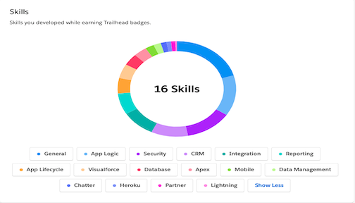

#### Hey 👋 , 

---

---
I am Software Engineer passionate about designing, developing and delivering quality softwares.

<!---
- 🌱 I’m currently learning application development using MERN and PERN stacks
- 💞️ I like to play around with new technologies and tools.
--->

<!---
dimples-app/dimples-app is a ✨ special ✨ repository because its `README.md` (this file) appears on your GitHub profile.
You can click the Preview link to take a look at your changes.
--->

###  Recent Tech Stack  :computer:     

<code></code>
<code></code>
<code></code>
<code></code>
<code></code>

<code></code>
<code></code>
<code></code>
<code></code>
<code></code>

 

###  Version Control

<code></code>
<code></code>

 

 

#### SALESFORCE_EXPEDITIONER

